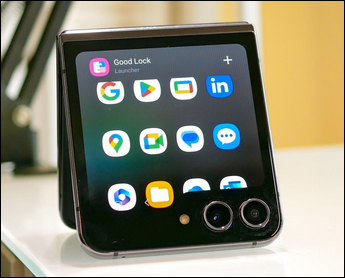

# ABChat

ABChat은 웹에서 사용 가능한 매우 가벼운 채팅 플랫폼입니다. 이 채팅방은 Discord의 주어진 채널과 연동됩니다.

## 목적
일말의 사유로 인해 Galaxy Z Flip의 매우 작은 전면 LCD와 디스코드를 연동할 필요가 있어 이 프로그램을 개발하였습니다.

프로그램을 개발하는 도중, 갑자기 Discord의 서버가 다운돼 채팅방의 친구들과 연락이 일시적으로 끊겼습니다. 따라서 ABChat은 Discord DB에 메시지 데이터를 의존하는 대신 독자적인 채팅 플랫폼으로 동작하고 Discord로는 연동만 되는 방향성을 갖기로 결정했습니다.

## 기능
- Galaxy Z Flip의 전면 LCD에서 동작하는 극한의 반응형 웹 인터페이스
- 간단한 WebSocket 기반 메시지 전송 및 브로드캐스팅
- 어드민 전용 유저 관리 (username+password 기반)
- Discord 봇을 통해 Discord 채널과 메시지 연동
